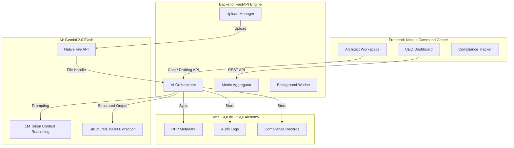

# 🏛️ Enterprise RFP AI Pipeline: The Next Generation of Bid Intelligence


---

## Table of Contents

1. [Problem Statement](#-1-the-problem-statement-why-rfp-management-is-broken)
2. [User Roles & Responsibilities](#-2-user-roles--responsibilities)
3. [What We Built](#-3-what-we-built-holistic-document-reasoning)
4. [Current Status & Roadmap](#-4-current-status--roadmap)
5. [System Architecture](#-5-system-architecture)
6. [Backend Stack](#-6-backend-stack-the-core-engine)
7. [API Endpoints](#-7-api-endpoints-reference)
8. [Project Structure](#-8-project-structure)
9. [End-to-End User Flow](#-9-end-to-end-user-flow)
10. [Frontend Stack](#-10-frontend-stack--implementation)
11. [AI Layer](#-11-the-ai-layer-beyond-simple-chat)
12. [Core Innovation](#-12-core-innovation-beyond-traditional-rag)
13. [Business Impact](#-13-business-impact)
14. [Performance & Scalability](#-14-performance--scalability)
15. [Challenges Faced](#-15-challenges-faced--engineering-triumphs)
16. [Environment Variables](#-16-environment-variables)
17. [Installation & Setup](#-17-installation--setup)
18. [UI Preview](#-18-ui-preview)
19. [License](#-19-license)

---

## 🚩 1. The Problem Statement: Why RFP Management is Broken

In the high-stakes world of government and enterprise procurement, a single Request for Proposal (RFP) can determine a company’s revenue for the next decade. Yet the process remains outdated, manual, and error-prone.

* **The Context Fragmentation Trap**: Traditional AI solutions based on RAG split 200-page PDFs into small chunks. When the model only sees a small slice at a time, it loses context, misses critical clauses, and increases hallucination risk.
* **The Manual Extraction Bottleneck**: Senior executives and solution architects spend valuable time reading dense legal, commercial, and technical clauses just to decide whether a bid is worth pursuing.
* **Dashboard Latency**: Pipeline value, risk exposure, and bid readiness are often not visible in real time, making fast strategic decisions difficult.

This project was built to fix that.

---

## 👥 2. User Roles & Responsibilities

The system is designed around the workflows of an enterprise bid team.

| Role                   | Responsibility                                                                      | Primary View        |
| :--------------------- | :---------------------------------------------------------------------------------- | :------------------ |
| **CEO / Bid Director** | High-level decision making, Go/No-Go approval, and monitoring total pipeline value. | Executive Dashboard |
| **Solution Architect** | Technical analysis, proposal drafting, and AI-assisted solutioning.                 | Architect Workspace |
| **Compliance Analyst** | Extracting mandatory criteria and ensuring every clause has a response strategy.    | Compliance Matrix   |

---

## 💡 3. What We Built: Holistic Document Reasoning

We built a **Unified RFP Intelligence Pipeline**. It is not just a chatbot. It is an end-to-end decision-support system that treats an RFP as a single, living digital asset.

By using **native multimodal ingestion**, the system bypasses the limitations of text splitting. It understands layout, tables, structure, and document-wide relationships, allowing the AI to reason across the full RFP instead of isolated chunks.

---

## 📊 4. Current Status & Roadmap

| Phase       | Feature                                        | Status          |
| :---------- | :--------------------------------------------- | :-------------- |
| **Phase 1** | Native PDF Ingestion via Gemini File API       | ✅ Completed     |
| **Phase 1** | Automated Summary & Metric Extraction          | ✅ Completed     |
| **Phase 1** | Dashboard Bidding Analytics                    | ✅ Completed     |
| **Phase 2** | AI-Generated 19-Section Proposal Drafts        | ✅ Completed     |
| **Phase 2** | Compliance Matrix Extraction & Status Tracking | ✅ Completed     |
| **Phase 3** | Multi-role RBAC (CEO, PM, Architect)           | 🏗️ In Progress |
| **Phase 4** | External Data Connectors (SharePoint / Cloud)  | 📅 Planned      |

---

## 🏗️ 5. System Architecture

The system is designed for **contextual integrity**. Data flows from the raw PDF to the dashboard without losing structural meaning.



---

## ⚙️ 6. Backend Stack (The Core Engine)

The backend is a high-performance asynchronous engine built for heavy document processing.

* **FastAPI**: Provides the asynchronous backbone. Uploads and AI calls are handled without blocking the UI.
* **SQLAlchemy ORM**: Manages the relationship between documents, users, compliance items, and audit logs.
* **Background Tasks**: Time-intensive AI reasoning is decoupled from the request-response cycle.
* **Database Design**: Optimized for read-heavy dashboard access using cached AI summaries stored as JSON.

---

## 🔌 7. API Endpoints Reference

| Endpoint                  | Method | Description                                                                     |
| :------------------------ | :----- | :------------------------------------------------------------------------------ |
| `/uploads/rfp`            | `POST` | Ingests the PDF, uploads it to Gemini File API, and starts background analysis. |
| `/rfps`                   | `GET`  | Retrieves all RFPs with processing status.                                      |
| `/rfps/{id}`              | `GET`  | Returns full details, metadata, and cached summary for a specific RFP.          |
| `/rfps/dashboard-summary` | `GET`  | Returns pipeline value, risk counts, and dashboard metrics.                     |
| `/rfps/{id}/chat`         | `POST` | Context-aware chat using the unique file handle for that document.              |
| `/rfps/{id}/compliance`   | `GET`  | Returns the extracted compliance matrix items.                                  |

---

## 📁 8. Project Structure

```text
RFP/
├── rfp-backend/                  # FastAPI application
│   ├── app/
│   │   ├── api/routes/           # Endpoint definitions
│   │   ├── core/                 # Config, database, security
│   │   ├── models/               # SQLAlchemy models
│   │   ├── services/             # Business logic and AI orchestration
│   │   └── schemas/              # Pydantic schemas
│   ├── rfp_database.db           # Local SQLite database
│   ├── .env                      # Environment variables
│   └── main.py                   # App entry point
├── rfp-frontend/                 # Next.js application
│   ├── src/
│   │   ├── app/                  # App router pages
│   │   ├── components/           # UI components
│   │   ├── lib/                  # API client and utilities
│   │   └── hooks/                # Custom React hooks
│   └── package.json
└── README.md
```

---

## 🎯 9. End-to-End User Flow

1. A user uploads an RFP PDF.
2. The backend stores the document and sends it to the Google File API.
3. Gemini processes the document using the file handle and extracts structured intelligence.
4. The dashboard updates with key metrics such as value, deadline, and risk.
5. The solution architect uses the workspace to generate responses and ask questions.
6. The compliance analyst reviews extracted obligations and tracks fulfillment.

---

## 🎨 10. Frontend Stack & Implementation

A premium enterprise interface built with **Next.js 14** and **Tailwind CSS**.

* **State Management**: Localized React state for chat and workflow interactions, with polling for background ingestion progress.
* **API Client Layer (`api.ts`)**: A centralized communication layer that standardizes fetch calls, data shapes, and error handling.
* **Error Handling**: The UI handles API failures gracefully and keeps cached data available even when AI processing is delayed.
* **UX Focus**: Designed for fast scanning, clear hierarchy, and operational clarity.

---

## 🧠 11. The AI Layer: Beyond Simple Chat

The AI layer is powered by **Gemini 2.0 Flash**, with emphasis on multimodal document reasoning.

* **Native File Ingestion**: The document is uploaded directly using the file API, preserving layout, tables, and visual context.
* **Unique Handle (`file_uri`)**: The file is not repeatedly re-uploaded. The system reuses the handle for efficient, low-latency reasoning.
* **JSON-First Reasoning**: Every AI response is structured so the backend can reliably parse, validate, and store the output.

---

## 💎 12. Core Innovation: Beyond Traditional RAG

Most AI systems rely on Retrieval-Augmented Generation (RAG), which fragments documents into chunks and loses important context.

### Our approach

* **No Chunking**: The full document is processed holistically.
* **Long-Context Reasoning**: Gemini’s large context window enables document-wide understanding.
* **Layout Awareness**: Tables, headings, sections, and visual structure remain meaningful.
* **Cross-Section Intelligence**: The AI can connect clauses across distant sections of the same RFP.

This reduces context loss and improves precision in enterprise workflows where every clause matters.

---

## 📈 13. Business Impact

* **Time Savings**: Reduces initial RFP review time from days to minutes.
* **Better Accuracy**: Improves requirement tracking and reduces manual errors.
* **Scalability**: Helps bid teams process more RFPs without adding headcount.
* **Decision Quality**: Gives executives earlier visibility into pipeline value and risk.

---

## 📈 14. Performance & Scalability

* **Async Everything**: File uploads, AI calls, and processing tasks are handled asynchronously.
* **Caching Strategy**: AI-generated summaries are cached so dashboards can load instantly.
* **Backoff Logic**: Exponential backoff improves resilience against API rate limits.
* **Read-Heavy Optimization**: Dashboard queries use stored summaries rather than recalculating intelligence on every request.

---

## 🛠️ 15. Challenges Faced & Engineering Triumphs

* **Quota Limits**: Early free-tier limits were handled by retry logic and improved SDK usage.
* **Table Extraction**: Moving from text extraction to multimodal file handling significantly improved table accuracy.
* **Dependency Conflicts**: Framework and SDK compatibility issues were resolved through careful version alignment.
* **Context Retention**: The biggest design challenge was preserving meaning across long, complex documents.

---

## 🔐 16. Environment Variables

Create a `.env` file inside the `rfp-backend` directory:

```env
GEMINI_API_KEY=your_google_ai_studio_key
DATABASE_URL=sqlite:///./rfp_database.db
PORT=8000
```

---

## 📦 17. Installation & Setup

### Backend

```bash
cd rfp-backend
pip install -r requirements.txt
python -m uvicorn app.main:app --reload --port 8000
```

### Frontend

```bash
cd rfp-frontend
npm install
npm run dev
```

---

## 🖼️ 18. UI Preview

### CEO Dashboard


### Architect Workspace


### Compliance Matrix


---

## 📄 19. License

This project is licensed under the **MIT License**.

---

**Built by Veman Chippa under the guidance of Yash Kanvinde**
**DHIRA Software Labs | Advanced Agentic Coding**
