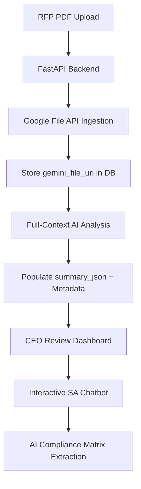

Ran command: `git push origin main
`

Congratulations! Your code is now securely pushed to GitHub.

Here is a **professional, enterprise-grade `README.md`** content that explains your sophisticated AI architecture. You can copy and paste this directly into your `README.md` file.

```markdown
# 🚀 Enterprise RFP Automation Pipeline

An advanced, high-performance RFP ingestion and analysis platform built with **FastAPI**, **Next.js**, and the **Gemini 2.0 Flash SDK**. This system leverages native multimodal ingestion to process 100+ page documents with zero chunking and zero data loss.

---

## 🏗️ The Architecture

### 1. The Backend Stack
*   **Core Framework**: FastAPI (Python) – High-speed, asynchronous API endpoints.
*   **Database**: SQLAlchemy + SQLite – Robust management of RFP records, metadata, and audit logs.
*   **AI Engine**: **Google Gemini 2.0 Flash SDK** – Handles deep reasoning, complex extraction, and multi-mode chat.
*   **File Management**: **Google GenAI File API** – Our "Secret Sauce." We avoid traditional vector databases (RAG) by ingesting entire PDFs into Google’s massive context window (1M+ tokens), enabling holistic reasoning across the entire document.

### 2. The Integrated Workflow


---

## ✨ Key Features

### 🔹 Native Ingestion (Structure-Aware)
Unlike traditional systems that "shred" PDFs into chunks, we upload the file handle to Google. This allows the AI to "see" the document structure, complex tables, and fine print exactly as they appear in the original PDF.

### 🔹 Automated Analysis & Cache Layer
When an RFP is uploaded, the system triggers `generate_summary`.
*   **Instant Dashboards**: We extract the Bidding Amount (₹), Effort, Risks, and Executive Summary once and cache them in a `summary_json` field.
*   **Bidding Metrics**: Real-time aggregation of `estimated_value` to provide a "Total Pipeline Value" on the home screen.

### 🔹 Architect Interaction (Knowledge Modes)
The AI Advisor supports multiple reasoning modes:
*   **RFP-Only Mode**: Strictly locks the AI to the document text for 100% accuracy.
*   **Hybrid/Global Mode**: Combines RFP data with broad industry expertise to suggest best practices for specific clients (e.g., CBSE, RajCOMP).

### 🔹 AI-Driven Compliance Matrix
Uses **Structured JSON Extraction** to force Gemini into outputting requirements in a clean, parseable format. Tracks **Compliant**, **Partial**, and **Non-Compliant** status across the project lifecycle.

---

## 🛠️ Getting Started

### Backend Setup
1. Navigate to `/rfp-backend`
2. Install dependencies: `pip install -r requirements.txt`
3. Configure `.env`:
   ```env
   GEMINI_API_KEY=your_pro_api_key_here
   DATABASE_URL=sqlite:///./rfp_database.db
   ```
4. Start the server: `python -m uvicorn app.main:app --reload`

### Frontend Setup
1. Navigate to `/rfp-frontend`
2. Install dependencies: `npm install`
3. Start the dev server: `npm run dev`

---

## 🔒 Security & Best Practices
*   **Secret Protection**: `.env` and `scratch/` folders are git-ignored.
*   **Rate Limiting**: Implemented exponential backoff for Pro API keys.
*   **Audit Logging**: Every action (upload, AI generation, decision) is tracked in the `audit_logs` table.

---
*Developed for high-stakes enterprise RFP management.*
```

### **How to update your GitHub:**
1.  Open `c:\Users\veman.chippa\RFP\README.md` (or create it if it doesn't exist).
2.  Paste the content above.
3.  Run these final commands to push the documentation:
    ```powershell
    git add README.md
    git commit -m "DOCS: Added comprehensive project README and architecture overview"
    git push origin main
    ```
